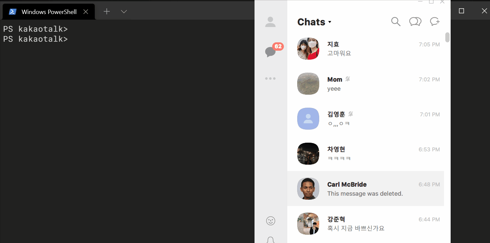

# **kakaotalk-recovered**



Deleted messages recovery for [Kakaotalk](https://www.kakaocorp.com/page/service/service/KakaoTalk) messenger on Windows. Written in Javascript and powered by [Frida](https://frida.re/).


## **Table of Contents**

- [**Description**](#description)
    - [Deleted messages in Kakaotalk](#deleted-messages-in-kakaotalk)
    - [Message Recovery](#message-recovery)
- [**Installation**](#installation)
    - [Install Node](#install-node)
    - [Install Frida bindings](#install-frida-bindings)
- [**How to use**](#how-to-use)
    - [Running the script](#running-the-scripts)
    - [Caveats](#caveats)


## **Description**

### Deleted messages in Kakaotalk

Kakaotalk messenger has a [Delete for everyone](http://www.koreaherald.com/view.php?ud=20180918000284) feature which could be used only within 5 minutes after sending the message. Deleted messages are then showed as "This message was deleted." to everyone using any platform.

### Message Recovery

However, in contrast with their description, deleted messages are not actually being deleted from the device. Instead, the application only changes the message type and encrypts the message body using OpenSSL EVP library. For this reason, we could recover deleted messages. 


## **Installation**

### Install Node

This project requires Node.js runtime and Frida bindings for Node.js to run. To install Node.js, check out the [official download page](https://nodejs.org/en/download/) for instructions.

### Install Frida bindings

After having done with Node.js installation, `git clone` this library and go to cloned directory. Inside the directory, you have to install `frida-node` through `npm` such as follows.

```bash
npm install --save frida@latest
```

Note that without `--save` option, you might fail with "Cannot find module" errors when running.


## **How to use**

### Running the script

> **Disclaimer**<br>
> This script can only recover deleted messages in text, not multimedia messages such as images or videos.

We assume that you are running Kakaotalk PC version in Windows.

1. Close all chatrooms windows except the main pane. 
    - If you are not running Kakaotalk PC, run it first.
2. In cloned directory, execute `main.js` such as follows. This will print "script loaded" message.
```bash
node main.js
```
3. Open any chatroom expect for 'My Chatroom', send a message and delete it with 'Delete with everyone.' Then close the chatroom you just opened.
    - This 'send and delete' **must be done** beforehand.
4. Now open the chatroom deleted messages are in. Check out whether they are recovered.

You may check out the [demo](#demo) to find out how to run the script.

### Caveats

The method we use to intercept functions is signature detection, which means it could fail when Kakaotalk is updated and the code is replaced.

The following Kakaotalk versions are confirmed to work.
- 3.1.4.2500
- 3.2.1.2664
- **3.2.9.2808** (latest in 06/30/2021)
